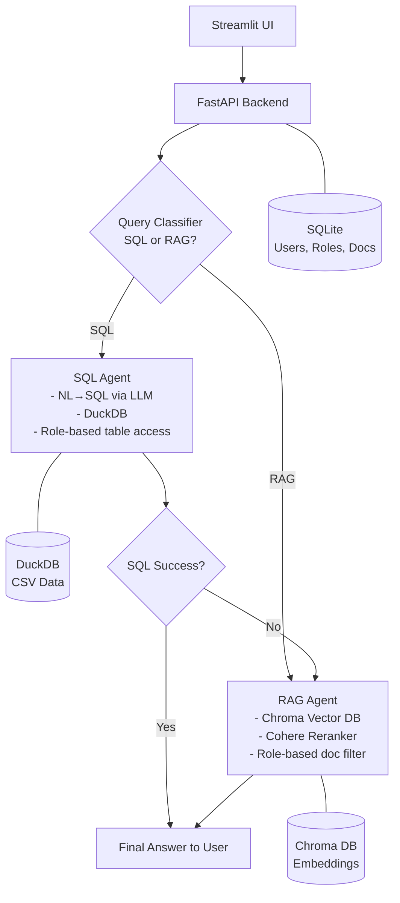

# **Project Report**
## **FinSight - AI document assistant - A Role-Based RAG System**

## **Project Overview**

This project implements an advanced **Retrieval-Augmented Generation (RAG)** system tailored for multi-role enterprise environments. Users can upload documents (Markdown, CSV), and the system retrieves answers based on the user's role. Queries are intelligently routed to the appropriate engine (LLM or SQL), and responses are enhanced by reranking and evaluated for quality. The architecture includes:

* **Streamlit UI**: for user login, role-based access, and document upload.
* **FastAPI backend**: for business logic, user management, and RAG handling.
* **Chroma vector store**: for dense embedding search (unstructured).
* **DuckDB**: for SQL-like queries over structured data (CSV).
* **Query Classifier**: to route user queries to the appropriate retrieval mode.
* **Fallback Mechanism**: to ensure graceful degradation when structured query fails.
* **Cohere Reranker**: to ensure better user trust in responses

## **System Architecture Diagram**

## **Key Features**

### **1. Role-Based Access Control**

* Users are assigned roles (e.g., HR, Finance, QA).
* Each document is tagged with the role it’s meant for.
* Queries are filtered to only retrieve content associated with the user's role.

### **2. Dual Query Handling (RAG + SQL)**

* **Unstructured queries** (e.g., "What are the QA best practices?") → handled by Chroma vector search + LLM.
* **Structured queries** (e.g., "Show me all employees with salary > 100K") → handled via DuckDB.
  
| Mode    | Triggered When              | Engine            |
| ------- | --------------------------- | ----------------- |
| **RAG** | General, text-based queries | Chroma DB + LLM   |
| **SQL** | Structured/tabular queries  | DuckDB SQL engine |

## **3. Why DuckDB for Structured Queries?**

Adopted **DuckDB** for handling structured queries on uploaded CSVs because:

* **In-process SQL engine**: DuckDB runs embedded in Python, no separate server needed.
* **Zero setup**: No configuration required; great for file-based structured queries.
* **Lightweight + Fast**: Efficiently handles large CSV files in memory.
* **Supports Pandas + SQL natively**: Easy to switch between Python dataframes and SQL.
* **Isolated query execution**: Each user session can be sandboxed.

This made DuckDB a perfect fit for answering precise, structured queries over tabular data uploaded by the user.

## **4. Query Classification Module**

A **query classifier** was implemented to determine the intent behind the user's input:

| Intent | Target System | Example Query                     |
| ------ | ------------- | --------------------------------- |
| RAG    | Chroma + LLM  | “Summarize this finance document” |
| SQL    | DuckDB        | “List invoices over \$5000”       |

* The classifier directs the query to either:

  * RAG (textual search in vector DB),
  * SQL (execute structured query using DuckDB).

This significantly **improved accuracy and speed**, avoiding LLM overhead when a SQL answer sufficed.

## **5. Reranking with Cohere**

To improve relevance of retrieved documents, added a **Cohere Reranker** in the RAG flow:

* After Chroma vector search retrieves top-k chunks,
* Reranker scores them based on their semantic match with the query,
* Only top-N reranked chunks are passed to the LLM

## **6. Fallback Handling Strategy**

In edge cases, a **fallback mechanism** is implemented:

1. If a **SQL query fails** (e.g., malformed, missing table):

   * Log the error,
   * Fallback to the RAG system with rephrased prompt like:
     *"Unable to process SQL. Try answering from available documents instead."*

2. If **no relevant docs** found in RAG:

   * Return a graceful message,
   * Suggest rephrasing or uploading new content.
This ensures the system is **resilient** and never leaves the user with a hard error.

## **7. Evaluation Framework for RAG (LLM-RAG Eval)**

An **automated evaluation pipeline** to assess output quality:

### Metrics:

* **Faithfulness**: Is the response grounded in retrieved content?
* **Relevance**: Is the answer contextually appropriate?
* **Conciseness**: Is it direct and non-redundant?

### How it works:

* Collect query-response pairs during usage
* Run them through an **OpenAI or LLM-based evaluator**
* Store per-metric scores in CSV for further analytics
* Used to compare performance with/without reranker and classifier

## **8. Automation Testing**

### **Backend API Testing – Pytest**

* FastAPI endpoints (`/chat`, `/upload`, `/register`, etc.) tested using `TestClient`
* Verified classifier routing, SQL execution, RAG fallback logic

### **Frontend Testing – Playwright**

* End-to-end tests for **Streamlit UI**:
  * Login flow
  * Role-based tab rendering
  * Document upload
  * Query submission and output display

* **Video recording** enabled for demo and review

## **Future Enhancements**

* Integrate **OpenInference** for evaluation (faithfulness, relevance).
* Support **admin analytics dashboard** (e.g., query types, usage).
* Add **table+text hybrid retrieval** (RAG with tabular fusion).
* Caching of SQL queries for repeated execution.

## **Conclusion**

This project delivers a **production-ready RAG system** with:
* Role-based access,
* Dual-mode intelligent query routing (LLM vs SQL),
* Reranking for precision,
* Automated evaluation and testing at every layer.

This RAG system demonstrates a **flexible, intelligent retrieval pipeline** that dynamically routes user queries to either unstructured (LLM-based) or structured (SQL-based) engines. The use of **DuckDB**, **query classification**, and **fallback design** has led to a robust solution that balances performance, explainability, and adaptability. With strong modularity and extensibility it’s an ideal architecture for real-world enterprise AI assistants where both document knowledge and structured analytics are needed in one place

## **Quick Start**
* Clone this repo
* Install dependencies
  
* Run the app:
* uvicorn app.main:app --reload 
* streamlit run app/ui.py

* Run tests:
* Backend tests : pytest tests/test_chatbot.py --html=report.html
* UI test :
* Start frontend & backend, then run the test_ui.py
* pytest tests/test_ui.py --headed  # to see browser
