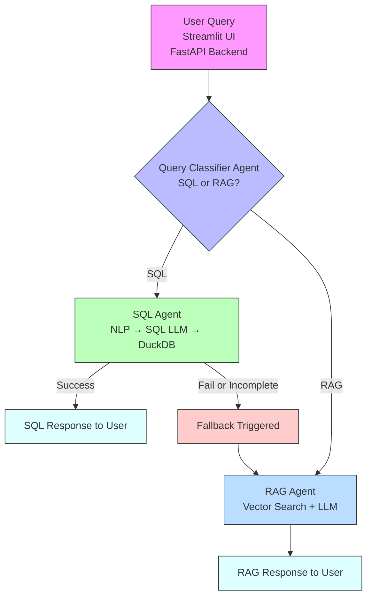

# **Project Report**
## **FinSight - AI document assistant - A Role-Based Access Control System**

## **Project Overview**

This project implements an advanced **Retrieval-Augmented Generation (RAG)** system tailored for multi-role enterprise environments. Users can upload documents (Markdown, CSV), and the system retrieves answers based on the user's role. Queries are classified and routed accordingly — SQL-type queries are translated to SQL using an LLM and executed on DuckDB, while RAG-type queries are answered via the retrieval-augmented generation pipeline, and responses are enhanced by reranking and evaluated for quality. The architecture includes:

* **Streamlit UI**: for user login, role-based access, and document upload.
* **FastAPI backend**: for business logic, user management, and RAG handling.
* **Query Classifier agent**: to route user queries to the appropriate retrieval mode.
* **SQL Agent**: processes structured data queries using an LLM for translation and DuckDB for execution.
* **RAG Agent**: retrieves and synthesizes responses from unstructured documents using embeddings and LLMs.
* **DuckDB**: for SQL-like queries over structured data (CSV).
* **Chroma vector store**: for dense embedding search (unstructured).
* **Fallback Mechanism**: to ensure graceful degradation when structured query fails.
* **Cohere Reranker**: to ensure better user trust in responses

## **System Architecture Diagram**



## **Key Features**

### **1. Role-Based Access Control**

* Users are assigned roles (e.g., HR, Finance, QA).
* Each document is tagged with the role it’s meant for.
* Queries are filtered to only retrieve content associated with the user's role.

### **2. Dual Query Handling (RAG + SQL)**

* **Unstructured queries** (e.g., "What are the QA best practices?") → handled by Chroma vector search + LLM.
* **Structured queries** (e.g., "Show me all employees with salary > 100K") → handled via DuckDB.
  
| Mode    | Triggered When              | Engine            |
| ------- | --------------------------- | ----------------- |
| **RAG** | General, text-based queries | Chroma DB + LLM   |
| **SQL** | Structured/tabular queries  | DuckDB SQL engine |


## **3. Why DuckDB for Structured Queries?**

Adopted **DuckDB** for handling structured queries on uploaded CSVs because:

* **In-process SQL engine**: DuckDB runs embedded in Python, no separate server needed.
* **Zero setup**: No configuration required; great for file-based structured queries.
* **Lightweight + Fast**: Efficiently handles large CSV files in memory.
* **Supports Pandas + SQL natively**: Easy to switch between Python dataframes and SQL.
* **Isolated query execution**: Each user session can be sandboxed.

This made DuckDB a perfect fit for answering precise, structured queries over tabular data uploaded by the user.


## **4. Query Classification Module**

A **query classifier** was implemented to determine the intent behind the user's input:

| Intent | Target System | Example Query                     |
| ------ | ------------- | --------------------------------- |
| RAG    | Chroma + LLM  | “Summarize this finance document” |
| SQL    | DuckDB        | “List invoices over \$5000”       |

* The classifier directs the query to either:

  * RAG (textual search in vector DB),
  * SQL (execute structured query using DuckDB).

This significantly **improved accuracy and speed**, avoiding LLM overhead when a SQL answer sufficed.

## **5. Fallback Handling Strategy**

In edge cases, a **fallback mechanism** is implemented:

1. If a **SQL query fails** (e.g., malformed, missing table):

   * Log the error,
   * Fallback to the RAG system with rephrased prompt like:
     *"Unable to process SQL. Try answering from available documents instead."*

2. If **no relevant docs** found in RAG:

   * Return a graceful message,
   * Suggest rephrasing or uploading new content.
This ensures the system is **resilient** and never leaves the user with a hard error.

## **6. Reranking with Cohere**

To improve relevance of retrieved documents, added a **Cohere Reranker** in the RAG flow:

* After Chroma vector search retrieves top-k chunks,
* Reranker scores them based on their semantic match with the query,
* Only top-N reranked chunks are passed to the LLM


## **7. Evaluation Framework for RAG (LLM-RAG Eval)**

An **automated evaluation pipeline** to assess output quality:

### Metrics:

* **Faithfulness**: Is the response grounded in retrieved content?
* **Relevance**: Is the answer contextually appropriate?
* **Conciseness**: Is it direct and non-redundant?

### How it works:

* Collect query-response pairs during usage
* Run them through an **OpenAI or LLM-based evaluator**
* Store per-metric scores in CSV for further analytics
* Used to compare performance with/without reranker and classifier


## **8. Automation Testing**

### **Backend API Testing – Pytest**

* FastAPI endpoints (`/chat`, `/upload`, `/login`, etc.) tested using `TestClient`
* Verified classifier routing, SQL execution, RAG fallback logic

### **Frontend Testing – Playwright**

* End-to-end tests for **Streamlit UI**:
  * Login flow
  * Role-based tab rendering
  * Document upload
  * Query submission and output display

* **Video recording** enabled for demo and review

## **Tech Stack**
 * AI/LLM: OpenAI GPT-4o, LangChain
 * Backend: FastAPI, SQLite, DuckDB
 * Frontend: Streamlit
 * Vector DB: Chroma DB
 * File Support: Markdown, CSV
 * Access Control: RBAC
 * Testing: Pytest, Playwright


## **Future Enhancements**

* Integrate **OpenInference** for evaluation (faithfulness, relevance).
* Support **admin analytics dashboard** (e.g., query types, usage).
* Add **table+text hybrid retrieval** (RAG with tabular fusion).
* Caching of SQL queries for repeated execution.

## **Conclusion**

This project delivers a **production-ready RAG system** with:
* Role-based access,
* Dual-mode intelligent query routing,
* Reranking for precision,
* Automated evaluation and testing at every layer.

This RAG system demonstrates a **flexible, intelligent retrieval pipeline** that dynamically routes user queries to either unstructured (LLM-based) or structured (SQL-based) engines. The use of **DuckDB**, **query classification**, and **fallback design** has led to a robust solution that balances performance, explainability, and adaptability. With strong modularity and extensibility it’s an ideal architecture for real-world enterprise AI assistants where both document knowledge and structured analytics are needed in one place

### Roles and Permissions

| **Role**              | **Permissions**                                                                                  |
|-----------------------|--------------------------------------------------------------------------------------------------|
| **Finance Team**      | Access to financial reports, marketing expenses, equipment costs, reimbursements, etc.          |
| **Marketing Team**    | Access to campaign performance data, customer feedback, and sales metrics.                      |
| **HR Team**           | Access to employee data, attendance records, payroll, and performance reviews.                  |
| **Engineering Dept.** | Access to technical architecture, development processes, and operational guidelines.            |
| **C-Level Executives**| Full access to all company data.                                                                 |
| **Employee Level**    | Access only to general company information such as policies, events, and FAQs.                  |

### Project structure
```
├── app
│   ├── __init__.py
│   ├── main.py                           ## FastAPI backend
│   ├── rag_evaluator                     ## Rag evaluation & results
│   │   ├── eval_merge_role_summary.py
│   │   ├── eval_summary.py
│   │   ├── evaluation_results_openai.csv
│   │   ├── evaluator.py
│   │   ├── final_eval_with_roles.csv
│   │   └── qa_pairs_openai.csv
│   ├── rag_utils                        ## Rag & SQL Agent
│   │   ├── __init__.py
│   │   ├── csv_query.py
│   │   ├── query_classifier.py
│   │   ├── rag_chain.py
│   │   ├── rag_module.py
│   │   └── secret_key.py                 ## API keys
│   └── ui.py                             ## Streamlit frontend
├── assets
│   └── style.css
├── report.html                           ## pytest report
├── requirements.txt
├── resources                             ## Finsolve Data 
├── static
│   ├── data
│   │   └── structured_queries.duckdb
│   ├── images
│   │   └── background.jpg
│   └── uploads                           ## stores all uploaded docs based on role
├── tests                                 ## Tests
│   ├── conftest.py
│   ├── sample_docs
│   │   └── sample_hr.md
│   ├── test_chatbot.py
│   └── test_ui.py
└── videos
    └── 36e32bb47b4f6cf28789e56b539f23e0.webm #Playwright video recording
```

## **Quick Start**

## 1. Clone the Repository

## 2. Install Dependencies
```bash
pip install -r requirements.txt
```

## 3. Add Your API Keys
Make sure to set your `OPENAI_API_KEY`, `LANGCHAIN_API_KEY` & `COHERE_API_KEY` in a secret_key.py file.

## 4. Run the Application
### Terminal 1 - Start FastAPI Server
```bash
uvicorn app.main:app --reload
```
### Terminal 2 - Start Streamlit UI
```bash
streamlit run app/ui.py
```
Then open your browser and go to:
```
http://localhost:8501
```


## 5. Run Tests
### Backend Tests
```bash
pytest tests/test_chatbot.py --html=report.html
```

### UI Tests
Ensure both the frontend and backend are running, then:
```bash
pytest tests/test_ui.py --headed  # --headed lets you see the browser
```

## **Query Samples**
HR: "List all employees with more than 20 leaves remaining."
Engineering: "What DevOps practices are followed in FinSolve?"
Finance: "What were the Q2 vendor expenses?"
General: "How can I apply for leave?"

